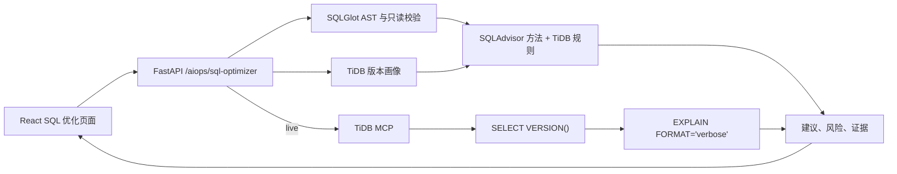

# SQL 优化模块开发说明

## 1. 模块定位

SQL 优化位于 AIOps 下，为 TiDB 只读查询提供“输入、解析、版本画像、计划验证、优化建议、证据追溯”闭环。模块借鉴 SQLAdvisor 的候选索引方法，但不复刻其 MySQL 依赖或把静态分析包装成 TiDB 优化器。

系统提供两种模式：

- **版本模拟**：基于 SQL AST、DDL 和 TiDB minor 版本规则生成计划假设，适合离线预检。所有节点明确标记为 `hypothesis`，不宣称等同真实计划。
- **真实 EXPLAIN**：通过已配置的 TiDB MCP 连接先执行 `SELECT VERSION()`，版本匹配后执行 `EXPLAIN FORMAT='verbose'`，计划来自目标集群。

## 2. 用户流程

1. 用户进入“AIOps > SQL 优化”。
2. 通过文本框输入 SQL 和 DDL，或上传多个 `.sql/.ddl/.txt` 文件，或从受控目录读取。
3. 选择 TiDB 版本和“版本模拟/真实 EXPLAIN”。
4. 真实模式可输入 MCP endpoint；留空时复用系统已配置连接。
5. 点击“生成优化建议”，查看计划节点、风险、索引/改写/统计建议、版本能力和证据来源。
6. 在预发布或只读副本验证建议，经过变更审批后再实施索引或 SQL 改写。

## 3. 组件与数据流



## 4. 输入设计

| 输入方式 | 支持内容 | 约束 |
|---|---|---|
| 页面输入 | 单条 SELECT/CTE、可选 CREATE/ALTER TABLE DDL | SQL 20 万字符，DDL 40 万字符 |
| 文件上传 | 多个 `.sql/.ddl/.txt` | UTF-8；单文件 2 MiB；单请求 20 MiB |
| 本地目录 | 递归读取允许后缀 | 必须位于 `DATASET_ALLOWED_ROOTS`；Compose 默认 `/workspace/data` |

仓库内置 `data/sql-optimizer` 示例目录。浏览器不能绕过后端直接读取任意客户端目录；“本地目录”指部署节点上显式挂载并加入白名单的目录。

## 5. SQLAdvisor 方法迁移

当前规则保留 SQLAdvisor 中可解释、可迁移的部分：

- 从 WHERE、JOIN、GROUP BY、ORDER BY 提取候选列。
- 候选索引顺序为等值条件优先，GROUP/ORDER 次之，范围条件最后。
- 对比 DDL 中已有索引的左前缀，避免重复建议。
- 对前导通配 LIKE、无条件 JOIN、`SELECT *`、函数包裹谓词和全表扫描风险给出改写建议。

与 SQLAdvisor 不同，静态模式不伪造字段基数或驱动表结果集；缺失真实统计信息时只给候选项。真实模式以 TiDB EXPLAIN 为准，后续可扩展 `EXPLAIN ANALYZE`、`SHOW STATS_*`、Plan Binding 和 Index Usage 证据。

## 6. TiDB 版本画像

| 画像 | 源码基线 | 重点差异 |
|---|---|---|
| 7.5 LTS | `v7.5.0` / `069631e` | 分区全局统计异步合并；Fast Analyze/增量统计废弃 |
| 8.0 | `v8.0.0` / `8ba1fa4` | Index Usage、Auto Analyze 优先队列、Plan Cache、Index Merge |
| 8.1 LTS | `v8.1.0` / `945d07c` | Query Watch、Optimizer Fix Controls |
| 8.2 | `v8.2.0` / `821e491` | 自适应统计加载、复杂多列 Range、IndexJoin 与 MPP 裁剪 |
| 8.3 | `v8.3.0` / `1a0c3ac` | Projection 下推、谓词列统计、全局索引实验、`INL_MERGE_JOIN` 废弃 |
| 8.4 | `v8.4.0` / `1a9f0fa` | 实例级 Plan Cache、全局索引 GA、原生 `pkg/planner/indexadvisor` |
| 8.5 LTS | `v8.5.0` / `d13e52e` | Schema/统计缓存、统计稳定性、索引构建写限速 |

用户输入具体 patch 版本时，模拟模式使用对应 minor 规则包。patch 级优化器修复、系统变量和 Fix Control 必须通过同版本真实 TiDB 验证；这是避免产生“源码级精确模拟”错误结论的产品边界。

## 7. API 契约

`POST /api/v1/aiops/sql-optimizer/analyze` 请求示例：

```json
{
  "sql": "SELECT customer_id, SUM(amount) FROM orders WHERE created_at >= '2026-01-01' GROUP BY customer_id",
  "ddl": "CREATE TABLE orders (...)",
  "tidb_version": "8.5.4",
  "plan_mode": "simulate",
  "mcp_endpoint": null
}
```

响应包含分析 ID、请求/画像版本、模拟或真实计划节点、风险等级、建议、版本能力、假设和源码证据。真实模式返回 `version_verified=true` 和 `actual_tidb_version`；版本不匹配返回 HTTP 409。

## 8. 安全与落地要求

- AST 层只接受一条 SELECT/CTE，拒绝 DDL/DML 和多语句。
- MCP endpoint 只接受无内嵌凭据的 HTTP(S) URL；生产环境必须通过 `TIDB_MCP_ALLOWED_HOSTS` 配置精确主机白名单，并配合出口网络策略。
- 目录路径必须经过 `resolve()` 后仍位于白名单根目录，防止路径穿越。
- 模拟结果不会自动执行 `CREATE INDEX`，优化动作必须经过审批、窗口和回滚流程。
- 生产环境需限制 EXPLAIN/查询账号权限、并发、超时和资源组，并保留审计日志。

## 9. 后续工程化路线

1. 接入 TiDB 原生 `pkg/planner/indexadvisor` 离线服务，建立版本化容器镜像和黄金计划集。
2. 采集 `SHOW STATS_HEALTHY/HISTOGRAMS/BUCKETS`、Index Usage、Bindings 和 Session Variables，提高建议可信度。
3. 加入 `EXPLAIN ANALYZE` 安全开关、最大扫描行数、超时和只读副本策略。
4. 建立 7.5-8.5 的 TiDB Testkit 回归矩阵，并逐 patch 记录行为变化与适用规则。
5. 增加建议实施前后的计划、时延、扫描量、内存和回归对比。

## 10. 参考来源

- [SQLAdvisor](https://github.com/Meituan-Dianping/SQLAdvisor)
- [TiDB Planner 7.5](https://github.com/pingcap/tidb/tree/v7.5.0/pkg/planner)
- [TiDB Planner 8.5](https://github.com/pingcap/tidb/tree/v8.5.0/pkg/planner)
- [TiDB 版本发布说明](https://github.com/pingcap/docs/tree/master/releases)
