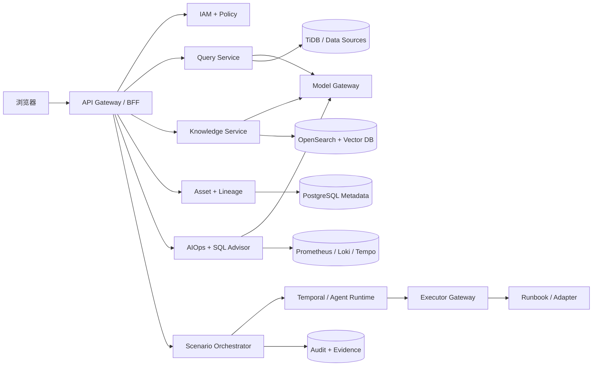

# 企业 AI 落地平台详细架构设计方案

版本：v1.0
日期：2026-08-19
对应产品：Aegis AI Control Plane
文档状态：开发基线

本文承接[产品设计方案](企业AI落地平台-产品设计方案.md)，并作为前端、后端和部署运维三份实施文档的共同技术基线。

## 1. 文档目标

本文把产品方案细化为可开发、可部署、可运维、可验收的技术基线，覆盖智能问数、AIOps、数据治理、智能指挥、任务审批和平台管理。首期面向企业内网/专有云，采用 B/S 架构，支持后续 SaaS 多租户演进。

### 1.1 首期约束

- 交付周期：12 周；团队建议 10～14 人。
- 首期规模：500 用户、100 并发在线用户、50 个数据源、10 万数据资产、日均 2 万问数请求、日均 10 万告警事件。
- 可用性目标：核心控制面 99.9%；RPO ≤15 分钟，RTO ≤60 分钟。
- 安全默认：只读、最小权限、全量审计；生产写操作必须经过策略和审批。
- 兼容目标：Chrome/Edge 最近两个大版本；桌面优先。

## 2. 架构决策

| 编号 | 决策 | 原因 |
|---|---|---|
| ADR-01 | MVP 使用模块化单体，AI Worker、Connector Worker、Executor 独立部署 | 降低分布式事务和运维成本，又隔离高负载与高风险任务 |
| ADR-02 | Java 21 + Spring Boot 3 为业务主后端，Python 3.12 为 AI/分析 Worker | 企业权限/事务能力成熟，Python 生态承载 LLM、RCA 和 SQL 分析 |
| ADR-03 | Temporal 承载长流程，Kafka 承载事件流 | 审批、等待、重试、补偿需要持久化工作流；高吞吐事件需要解耦 |
| ADR-04 | PostgreSQL 为控制面主库，OpenSearch 为检索与事件查询，Redis 为缓存 | 职责明确、生态成熟；业务数据不复制进控制面 |
| ADR-05 | 对象存储保存证据、导出、模型评测和执行产物 | 避免大对象进入关系库，支持生命周期管理 |
| ADR-06 | 模型统一经过 Model Gateway，内部协议兼容 OpenAI API | 统一接入云模型、本地模型和企业自建模型，屏蔽供应商差异 |
| ADR-07 | 生产执行使用独立 Executor Agent | 控制面不持有生产永久凭证，缩小攻击面 |
| ADR-08 | 语义层和 SQL AST 校验位于执行前强制路径 | LLM 不能绕过口径、权限和安全策略 |

## 3. 总体架构

```text
用户浏览器
   │ HTTPS / SSE
WAF / Ingress / API Gateway
   │
Web BFF ───────── IAM/SSO（OIDC/SAML、RBAC+ABAC）
   │
Aegis Core（模块化单体）
├─ Workspace/Tenant      ├─ Query Copilot
├─ Catalog/Governance    ├─ Incident/AIOps
├─ Task/Approval         ├─ Agent/Decision
├─ Policy/Audit          └─ Notification
   │              │                 │
PostgreSQL     Kafka/Temporal    Redis/OpenSearch/MinIO
   │              │
AI Worker     Connector Worker ── 企业数据与可观测系统（只读）
   │              │
Model Gateway     └──────── Executor Gateway ── Executor Agent ── 生产环境
   │
私有模型 / 经审批云模型 / Embedding / Reranker
```

控制面负责决策、编排和审计；数据面负责读取业务数据；执行面负责受控变更。三个平面网络隔离，凭证不跨边界持久化。

## 4. 代码与服务结构

建议 Monorepo：

```text
aegis/
├── apps/web                 # React 前端
├── apps/server              # Spring Boot 模块化单体/BFF
├── workers/ai-worker        # Python：LLM、RAG、SQL、RCA
├── workers/connector-worker # 元数据、指标、日志、调度采集
├── agents/executor-agent    # 生产侧动作执行器
├── packages/api-contract    # OpenAPI、事件 Schema、生成 SDK
├── packages/ui              # Design tokens 与通用组件
├── deploy/helm              # Kubernetes Helm Chart
├── deploy/compose           # 开发/PoC
├── db/migrations            # Flyway migration
└── docs/adr                 # 架构决策记录
```

Server 内部模块禁止直接访问其他模块的数据表，只通过应用服务接口或领域事件交互。达到以下条件之一才拆成独立微服务：独立扩缩容需求超过 3 倍、不同安全域、独立发布频率显著更高、单模块占用超过 40% 资源。

## 5. 模块详细设计

### 5.1 Web 前端

技术栈：React 19、TypeScript、Vite、React Router、TanStack Query、Zustand、Ant Design、ECharts、React Flow、Monaco Editor、SSE。

路由：`/workbench`、`/query`、`/aiops/incidents`、`/governance/assets`、`/command/rooms`、`/tasks`、`/approvals`、`/admin`。权限在路由和控件层提示，但最终授权只由服务端判定。

前端按领域分包；服务端状态交给 TanStack Query，会话草稿等临时状态交给 Zustand。问数流式响应、事件时间线使用 SSE；仅协同编辑场景使用 WebSocket。

### 5.2 IAM、租户与工作区

接入企业 OIDC/SAML，用户首次登录通过 JIT 创建。授权模型：

```text
允许 = RBAC角色许可 ∩ ABAC资源条件 ∩ 环境策略 ∩ 数据源原生权限
```

预置角色：PlatformAdmin、WorkspaceAdmin、Analyst、DataSteward、Operator、Approver、Auditor、Viewer。ABAC 属性包含 tenant、workspace、environment、asset_classification、department、owner。

所有业务表必须包含 `tenant_id`；应用层通过 TenantContext 强制注入，数据库启用 Row Level Security 作为第二道隔离。服务账号使用短期 Token，密钥由 Vault/OpenBao 托管。

### 5.3 智能问数 Query Copilot

执行链路：

```text
问题预处理 → 意图/领域识别 → 检索术语、指标、Schema、示例 SQL
→ 生成查询计划 → 确定性语义编译或 LLM 生成 SQL
→ AST 校验/权限/成本预估 → 只读执行
→ 结果质量检查 → 结论与图表 → 引用证据与反馈
```

关键组件：

- Semantic Registry：指标、维度、口径、时间粒度、关联路径和负责人；指标版本化发布。
- Context Builder：按工作区、权限、领域、可信度检索，禁止把无权 Schema 发给模型。
- SQL Planner：优先将已定义指标确定性编译为 SQL；开放式分析才调用 LLM。
- SQL Guard：基于 Apache Calcite/JSqlParser 或 SQLGlot AST，仅允许 SELECT/CTE；拦截注释绕过、多语句、DDL/DML、危险函数和跨域访问。
- Query Proxy：使用只读账号、事务只读、超时、最大行数、最大扫描量和并发配额；结果集落临时对象存储，默认 24 小时过期。
- Result Verifier：空结果、数量级、同比环比、单位、维度完整性和抽样复算；失败时不生成确定性结论。

问数状态机：`RECEIVED → PLANNING → NEED_CLARIFICATION | VALIDATING → EXECUTING → VERIFYING → COMPLETED | REJECTED | FAILED`。

置信度不是模型自报值，按指标命中、Schema 可信度、SQL 校验、结果验证、历史反馈加权计算。低于 0.6 必须标记“需确认”，不得生成强结论。

### 5.4 数据目录、关系和治理

Connector Worker 周期采集数据库元数据、调度 DAG、OpenLineage 事件和查询日志。标准化资产 URN：

```text
urn:aegis:{tenant}:{platform}:{instance}:{database}:{schema}:{object}[#{column}]
```

血缘边包含 source、target、edge_type、extraction_method、confidence、observed_at、valid_from/to。SQL 解析生成表级/字段级血缘；解析失败进入人工治理队列。

OpenSearch 保存资产搜索文档；PostgreSQL 保存权威元数据；MVP 血缘图使用 PostgreSQL 递归 CTE，资产超过 100 万或三跳查询 P95 超过 2 秒时再引入 Neo4j/JanusGraph。

SQL 资产流程：采集 → 指纹归一化 → 聚类去重 → 解析引用 → 风险评分 → 绑定负责人/指标 → 归档。严禁存储未脱敏的 SQL Literal 和用户隐私参数。

### 5.5 AIOps Engine

输入适配 Alertmanager Webhook、OpenTelemetry、Loki/OpenSearch、Kubernetes Event、Airflow/DolphinScheduler。统一事件模型后写 Kafka `observability.raw.v1`。

处理管道：标准化 → 去重（fingerprint）→ 降噪/抑制 → 拓扑关联 → Incident 聚合 → 证据采集 → RCA 假设 → Runbook 匹配 → 风险判定 → 审批/执行 → 验证 → 关闭/升级。

Incident 状态机：`OPEN → TRIAGING → DIAGNOSED → PENDING_APPROVAL → MITIGATING → VERIFYING → RESOLVED → CLOSED`，任一自动步骤可转 `HUMAN_REQUIRED`。

RCA 使用“规则与拓扑优先、统计异常其次、LLM 归纳最后”的组合。每个根因候选必须附证据、时间相关性、拓扑距离和反证；LLM 只负责组织假设，不得伪造观测数据。

### 5.6 Runbook、执行与审批

Runbook 使用版本化 YAML DSL：

```yaml
id: restart-k8s-deployment
version: 3
risk: medium
inputs: [cluster, namespace, deployment]
preconditions: [replicas_available_gte_1, change_window_open]
steps:
  - action: kubernetes.rollout_restart
    timeout: 120s
verify:
  - metric: error_rate
    condition: "value < baseline * 1.1"
rollback: kubernetes.rollout_undo
approvalPolicy: ops-single
```

执行前做 Schema 校验、参数绑定、策略评估和 dry-run。Executor Agent 仅拉取签名任务，不接受控制面任意 Shell；动作来自版本化插件白名单。执行结果逐步签名回传。网络中断时默认停止，不推断成功。

风险等级：Low 可自动执行已审核动作；Medium 单人审批；High 双人审批且必须灰度；Critical 禁止自动化。审批记录包含请求快照，Runbook 或参数变化会使原审批失效。

### 5.7 Agent Orchestrator 与智能指挥

场景中心在此之上提供统一 Scenario Catalog 和 Scenario Run 状态机。Catalog 保存 12 个场景模板的 Agent、触发器、集成、风险和指标；Run 保存目标、上下文、当前步骤、证据、审批计数和审计。高风险步骤状态转换为 `WAITING_APPROVAL`，未获得当前步骤审批时任何推进请求返回冲突，不能通过客户端绕过。

外部系统采用 Adapter SPI，统一暴露连接测试、只读查询、动作 Schema、权限声明、超时、幂等键和结果标准化。首期 Adapter 对接调度、可观测性、TiDB、代码交付、安全、成本和项目系统；生产执行仍由 Executor Gateway 接管。

Agent 是受控工作流角色，不是无限循环机器人。定义包含目标、允许工具、数据范围、模型、最大步数、Token/时间预算、升级条件和输出 Schema。

Temporal Workflow 持久化每个根任务；专业 Agent 作为 Activity 并行执行。指挥官只能分派预注册能力，不能临时提升权限。上下文分为会话记忆、工作区知识、事件证据；长期记忆写入前必须脱敏、标注来源并经过保留策略。

决策输出采用结构化 JSON：影响、证据引用、候选方案、风险、收益、回滚、推荐项、待确认项。缺少证据或回滚方案时不能进入执行流程。

### 5.8 模型网关与 RAG

Model Gateway 提供 OpenAI-compatible API，能力包括模型路由、限流、重试、熔断、缓存、Prompt 模板版本、PII 脱敏、Token 成本、审计和供应商降级。模型配置按任务类型绑定，生产不允许客户端指定任意模型。

#### 5.8.1 多模型接入架构

```text
Aegis业务模块
     │ 统一 Chat/Embedding/Rerank/Tool Calling 接口
Model Gateway
├─ OpenAI-Compatible Adapter ── vLLM / LocalAI / LM Studio / 自建网关
├─ Ollama Adapter ───────────── 本地 Ollama 模型
├─ TGI Adapter ──────────────── Hugging Face TGI
├─ Cloud Adapter ────────────── OpenAI / Azure OpenAI / Anthropic / Gemini
├─ China Cloud Adapter ──────── 通义千问 / DeepSeek / 豆包 / 智谱等
└─ Custom Adapter SPI ───────── 企业自研 HTTP/gRPC 模型服务
```

平台不把业务代码绑定到具体模型 SDK。Adapter 统一实现：`chat`、`streamChat`、`embed`、`rerank`、`health`、`listModels`、`countTokens`；不支持的能力通过 Capability 声明，不做静默模拟。

模型注册表字段：provider、endpoint、model_id、deployment、credential_ref、capabilities、context_window、max_output、tool_calling、structured_output、embedding_dimension、data_boundary、cost、timeout、enabled。凭证只保存 Vault 引用，页面永不回显密钥。

企业自建模型只需满足以下一种接入方式：

1. 推荐：实现 OpenAI-compatible `/v1/chat/completions`、`/v1/embeddings` 和流式 SSE。
2. 通过 vLLM/TGI/Ollama 暴露标准服务，再由内置 Adapter 接入。
3. 实现 Custom Adapter SPI，将企业私有协议映射为统一请求/响应 DTO。

Provider 配置示例：

```yaml
providers:
  - id: private-qwen
    type: openai-compatible
    endpoint: http://vllm.aegis-model.svc:8000/v1
    credentialRef: vault://aegis/model/private-qwen
    networkZone: local-only
    models:
      - id: qwen-enterprise
        capabilities: [chat, stream, json_schema, tool_calling]
        contextWindow: 32768
        dataClassesAllowed: [internal, confidential]
  - id: local-embedding
    type: ollama
    endpoint: http://ollama.aegis-model.svc:11434
    models:
      - id: bge-m3
        capabilities: [embedding]
        embeddingDimension: 1024
```

注册时执行连通性、上下文长度、流式输出、JSON Schema、工具调用、Embedding 维度和并发探测，形成能力画像。模型必须通过离线评测后才能从 `DRAFT` 晋级 `VALIDATED`，生产路由仅使用 `PUBLISHED` 模型。

#### 5.8.2 模型路由与降级

路由键由任务类型、数据密级、工作区、语言、延迟、成本和能力组成。例如：敏感 Schema 仅允许本地模型；SQL 生成选择 SQL 评测分最高的模型；摘要可选择低成本模型；RCA 必须支持长上下文与结构化输出。

路由顺序：策略过滤 → 能力过滤 → 健康度过滤 → 质量/延迟/成本评分 → 主模型调用。超时或限流时仅降级到同等数据边界的备用模型，禁止从“仅本地”自动降级到公网云模型。模型切换、失败和降级全部写入审计。

#### 5.8.3 本地推理资源

小规模 PoC 可使用 Ollama/LocalAI；生产 GPU 推理建议 vLLM 或 TGI，并独立部署在 `aegis-model` Namespace。GPU Node 使用污点/容忍、显存监控和独立 HPA；模型权重放本地只读卷或内部对象存储。平台支持“无 GPU 模式”，连接企业已有模型服务，不强制随产品部署模型。

RAG 文档经过解析、分块、权限标签、Embedding 后写向量索引；召回时先权限过滤，再混合检索（BM25 + Vector），最后 Rerank。回答引用必须能回链到 `evidence_id` 和原始版本。

### 5.9 通知、任务与审计

通知采用 Outbox Pattern，支持站内、邮件、飞书/企微/钉钉；相同 fingerprint 在静默窗口合并。任务、审批、Incident 可互相关联。

审计事件只追加不可更新，记录 actor、tenant、action、resource、request_id、policy_result、before/after hash、model/prompt version、evidence、timestamp。按月归档到 WORM 对象存储，在线保留 180 天，归档不少于 3 年（可按企业制度调整）。

## 6. 核心数据模型

| 聚合 | 关键表 | 说明 |
|---|---|---|
| 身份 | tenant, workspace, user, role, policy_binding | 租户与授权 |
| 数据治理 | data_source, asset, asset_column, lineage_edge, metric, metric_version | 元数据与口径 |
| 问数 | conversation, message, query_plan, sql_execution, result_artifact, feedback | 全链路追踪 |
| AIOps | event, incident, incident_event, rca_hypothesis, evidence | 事件与诊断 |
| 执行 | runbook, runbook_version, execution, execution_step, approval | 受控动作 |
| Agent | agent_definition, agent_run, tool_call, decision | 智能体运行 |
| 平台 | connector, secret_reference, notification, audit_event | 集成与审计 |

主键使用 UUIDv7；所有可变业务表包含 `version` 做乐观锁，时间统一 UTC 存储。敏感字段采用信封加密；日志不得输出凭证、SQL 结果和完整 Prompt。

## 7. API 与事件契约

REST API 统一前缀 `/api/v1`，使用 OIDC Bearer Token；写请求支持 `Idempotency-Key`；错误遵循 RFC 9457 Problem Details；列表使用 cursor 分页。

代表性接口：

```text
POST /query/conversations/{id}/messages
GET  /query/executions/{id}
POST /query/executions/{id}/cancel
GET  /assets/{urn}/lineage?direction=both&depth=2
POST /incidents
POST /incidents/{id}/diagnose
POST /executions/{id}/dry-run
POST /approvals/{id}/decisions
GET  /audit-events?resourceId=...
```

所有异步请求返回 `202 + operation_id`，前端通过 SSE `/operations/{id}/events` 获取状态。OpenAPI 作为单一契约源生成 TypeScript/Python SDK。

Kafka Topic：`metadata.changed.v1`、`query.completed.v1`、`observability.raw.v1`、`incident.changed.v1`、`execution.requested.v1`、`audit.created.v1`。事件必须包含 event_id、tenant_id、occurred_at、schema_version、trace_id；消费者至少一次处理并用 event_id 幂等。

## 8. 关键链路时序

### 8.1 智能问数

1. BFF 完成身份和工作区校验，创建 trace/query ID。
2. Context Builder 仅检索用户有权的指标与 Schema。
3. Planner 生成结构化计划；缺少口径时返回澄清问题。
4. SQL Guard 做 AST、授权、扫描成本和资源配额检查。
5. Query Proxy 使用数据源只读凭证执行，结果脱敏并落临时存储。
6. Verifier 校验结果，生成图表建议与引用；审计异步落盘。

### 8.2 AIOps 自动处置

1. 告警进入 Kafka，聚合器创建/关联 Incident。
2. Connector Worker 拉取时间窗内日志、指标、变更并形成 Evidence。
3. RCA 引擎输出有证据的候选根因，策略引擎匹配 Runbook。
4. Temporal 等待所需审批，超时自动升级人工。
5. Executor dry-run、执行、验证；失败时按 Runbook 回滚。
6. 状态和证据回写 Incident，通知相关人员，生成复盘草稿。

## 9. 部署架构

### 9.1 开发与 PoC

Docker Compose 支持在一台 Linux/macOS 主机本地部署 Web、Server、AI Worker、PostgreSQL、Redis、OpenSearch、MinIO、Kafka、Temporal，并可选启动 Ollama。默认提供 `core`、`observability`、`local-model` 三个 Profile；8 核 CPU、32GB 内存、100GB 磁盘可运行基础版，不启动本地大模型时最低可降至 4 核/16GB。

本地安装包必须提供 `.env.example`、初始化向导、数据库迁移、健康检查、启停/升级/备份脚本和版本锁定的镜像清单。首次启动创建管理员后强制修改口令；默认监听本机或内网地址，不对公网开放。

### 9.2 生产 Kubernetes

- 至少 3 个 Worker Node，跨可用区部署；Ingress 双副本。
- Web/Server/Worker 最少 2 副本，配置 HPA、PodDisruptionBudget 和反亲和。
- PostgreSQL 使用企业托管 HA 或 Patroni；Kafka/OpenSearch 至少 3 节点；对象存储开启版本化。
- Executor Agent 部署在目标安全域，通过 mTLS 主动出站连接 Executor Gateway，不开放入站端口。
- Namespace 分为 `aegis-control`、`aegis-data`、`aegis-execution`、`aegis-observability`；NetworkPolicy 默认拒绝。
- Dev/Test/Prod 使用独立集群或至少独立账号、密钥、库和命名空间；禁止共用生产凭证。

### 9.3 企业内网与完全离线部署

支持三种交付拓扑：

| 形态 | 适用范围 | 部署方式 |
|---|---|---|
| 单机本地版 | 开发、演示、小型试点 | Docker Compose，可接 Ollama 或远程模型 |
| 企业内网版 | 正式生产、私有云 | Kubernetes/Helm，连接企业 SSO、数据库和自建模型 |
| 完全离线版 | 涉密或无互联网环境 | 离线镜像包、模型权重包、内部镜像仓库、禁用全部公网 Adapter |

离线交付包包含 OCI 镜像、Helm Chart、Compose 文件、OS/架构兼容清单、SBOM、签名与校验文件、数据库迁移包、前端静态资源、Python Wheel/模型依赖和操作手册。构建环境生成 manifest，部署环境先离线验签再导入内部 Registry。

离线模式通过 `egressPolicy=deny` 关闭公网访问、云模型 Provider、遥测上报和在线更新；许可证、时间同步、漏洞库和模型权重均支持离线导入。系统不得因无法访问公网而阻塞登录、问数、AIOps、审计或升级回滚。

### 9.4 配置与升级

配置分为非敏感 ConfigMap、敏感 Secret/Vault、租户级数据库配置。所有配置有 Schema 校验和版本记录。升级采用“备份 → 兼容性检查 → 数据库 expand migration → 滚动升级 → contract migration”；支持回退到上一镜像。破坏性数据库变更至少跨两个版本完成，不与应用发布一次性执行。

## 10. 非功能设计

### 10.1 性能与容量

| 场景 | SLO |
|---|---|
| 普通 API | P95 <500ms（不含外部系统） |
| 资产搜索 | P95 <1s |
| 两跳血缘 | P95 <2s |
| 问数首个流式状态 | <2s；简单查询完整结果 P95 <15s |
| 告警接收 | 峰值 1,000 event/s，端到端入库 P95 <5s |
| P1 初次诊断摘要 | <5 分钟 |

连接器和 AI Worker 通过队列水平扩展；每租户设置并发、Token、查询扫描量和存储配额。压测需覆盖 2 倍预计峰值，并验证降级而非级联失败。

### 10.2 高可用与容灾

所有服务无状态化；Temporal/Kafka 保证流程恢复；外部调用采用指数退避、熔断和超时。数据库每日全量、15 分钟增量/WAL，季度做恢复演练。模型不可用时降级为规则、搜索和人工流程，不阻断告警接收与审批。

### 10.3 可观测性

使用 OpenTelemetry 统一 Trace、Metric、Log；每个请求贯穿 `trace_id`、`tenant_id`、`operation_id`。核心指标包括问数成功率/校验失败率、LLM 延迟与成本、告警压缩率、RCA 采纳率、Runbook 成功/回滚率、审批时长、Connector 延迟、审计落盘延迟。

### 10.4 安全

按等保三级思路设计：WAF、MFA、堡垒/审批、mTLS、数据库 TLS、静态加密、镜像签名、SBOM、依赖扫描、K8s Pod Security、密钥轮换。防 Prompt Injection 时将用户内容与系统指令分层，工具调用只接受结构化参数，检索内容视为不可信数据，模型无直接网络和凭证访问。

## 11. 开发、测试与发布

主干开发 + 短分支；提交触发单测、契约测试、SAST、依赖/镜像扫描。合并后生成不可变镜像和 SBOM，经集成、性能、安全、AI 评测门禁后逐环境晋级，生产使用 Canary/Blue-Green。

测试矩阵：领域单元测试；数据库/Testcontainers 集成测试；OpenAPI/事件契约测试；Playwright E2E；权限矩阵测试；SQL 对抗集；Prompt Injection 红队；历史 Incident 回放；Runbook dry-run 和回滚演练。

AI 质量门禁：固定问题集的指标命中率、SQL 执行正确率、结果一致率和引用完整率不得低于基线；Prompt 或模型变更必须版本化并 A/B 或影子验证。

## 12. 12 周实施计划

| 周期 | 交付内容 | 退出条件 |
|---|---|---|
| 1-2 | 工程骨架、SSO、租户、CI/CD、基础设施 | 可登录、可部署、审计通路可用 |
| 3-4 | 数据源管理、元数据采集、资产目录、指标模型 | 接入 2 类数据库、10 张核心表 |
| 5-6 | 问数规划、语义层、SQL Guard、只读执行 | 20 个指标评测通过，写 SQL 全拦截 |
| 7-8 | 告警接入、Incident、证据采集、RCA 摘要 | 5 类历史事故可回放 |
| 9-10 | Runbook、Temporal、审批、Executor、通知 | 10 个 Runbook dry-run/回滚通过 |
| 11 | 指挥工作台、血缘、运营指标、权限补强 | 三条端到端链路验收 |
| 12 | 压测、安全测试、容灾演练、试点上线 | 达到 SLO、安全和业务验收门槛 |

团队：产品经理 1、架构/技术负责人 1、前端 2、Java 后端 3、Python/AI 2、数据工程 1、测试 2、DevOps/SRE 1、安全与业务专家兼职。

## 13. 上线验收清单

- 功能：问数、资产血缘、Incident、审批执行三条链路端到端通过。
- 数据：20 个指标有负责人、定义、版本、权限和测试用例。
- 安全：越权、写 SQL、Prompt Injection、任意命令执行测试全部阻断。
- 执行：所有 Runbook 有前置条件、风险、验证、回滚和负责人。
- 运维：监控告警、备份恢复、容量、值班手册和故障降级齐备。
- 质量：有效问数 ≥80%，核心血缘覆盖 ≥70%，低风险 Runbook 成功率 ≥95%。
- 审计：查询、模型、审批、工具调用和执行事件完整率 100%。
- 组织：明确平台 Owner、数据 Steward、值班人员、审批人和安全责任人。
- 本地部署：在无公网环境从离线包完成安装、备份、升级和回滚演练。
- 模型兼容：至少完成一个云模型、一个 OpenAI-compatible 自建模型和一个本地 Embedding 模型的注册、评测、路由、流式输出及故障降级测试。

## 14. 演进路径

MVP 后优先按真实瓶颈演进：Query/AIOps 独立扩容；引入 CDC 更新元数据；扩展数据质量与发布评审；资产百万级后评估图数据库；多地域时拆分区域 Executor Gateway；自治等级只对历史成功率高、影响边界清晰、可快速回滚的 Runbook 逐项开放。

## 15. 开工前必须确认的业务输入

1. 部署形态、并发量、数据保留期和等保/审计要求。
2. 首批数据库、监控、日志、调度、Git、消息平台及其版本。
3. 20 个核心指标、10 张关键表、5 类高频告警和 10 个候选 Runbook。
4. 数据分级分类、行列权限、脱敏规则和允许发送给模型的数据边界。
5. Low/Medium/High/Critical 风险矩阵、审批人、变更窗口和应急升级链。
6. 模型部署方式、中文/SQL 能力评测基线、成本和延迟预算。

这些输入确认后，本架构可直接进入接口详细设计、数据库物理设计、页面交互稿和 Sprint 拆分。

## 16. 知识库与 RAG 子系统补充

知识库采用 Loader → Parser → Splitter → Indexer → Hybrid Retriever → ACL Filter → Reranker → Answer Composer → Citation Validator 管线。MVP 使用内存和词法检索；生产使用 PostgreSQL、MinIO、OpenSearch 与 pgvector/Qdrant/Milvus。Embedding、Rerank 和 Chat 通过 Model Gateway 适配云模型与自建模型；权限在召回前下推，回答保存引用和审计。详见《知识库模块产品与研发设计方案》。

## 17. v2 模块化运行架构

产品目录中的模块不是简单菜单，而是 8 个边界上下文。起步阶段采用模块化单体 + Python Worker；达到容量或团队边界后，按下表拆分部署单元。

| 模块 | 领域服务 | 主要存储 | 异步任务/事件 | 外部依赖 |
|---|---|---|---|---|
| 智能问数 | Query Service、Semantic Registry、Query Proxy | PostgreSQL、Redis、Query Audit | `query.requested`、`query.completed` | TiDB MCP、Model Gateway、ECharts |
| 企业知识库 | Knowledge API、Index Worker、Retriever | PostgreSQL、MinIO、OpenSearch、Vector DB | `document.ingest`、`index.ready` | Loader、Embedding、Reranker |
| 数据资产治理 | Metadata Service、Lineage Worker、Quality Service | PostgreSQL、OpenSearch、对象存储 | `asset.changed`、`lineage.updated` | TiDB、OpenLineage、DataHub/OpenMetadata |
| AIOps | Event Service、Evidence Worker、RCA Service | PostgreSQL、OpenSearch、时序库 | `incident.opened`、`evidence.collected` | Prometheus、Loki、Tempo、调度 |
| SQL 优化 | SQL Advisor、TiDB Profile Registry | PostgreSQL、Redis | `sql.analysis.requested` | TiDB EXPLAIN、版本源码/规则 |
| 场景指挥 | Scenario Orchestrator、Agent Runtime | PostgreSQL、Temporal、对象存储 | `scenario.started`、`step.waiting_approval` | Connector SPI、知识库 Retriever |
| 任务审批执行 | Policy Service、Approval、Executor Gateway | PostgreSQL、OPA、审计存储 | `approval.requested`、`execution.finished` | Vault/OpenBao、Rundeck/StackStorm |
| 平台管理 | IAM、Model Gateway、Connector Registry、Audit | PostgreSQL、Redis、Vault | `policy.published`、`provider.health_changed` | OIDC、各类 Provider |



### 17.1 请求和状态边界

- 同步读接口只负责鉴权、参数校验和读取聚合视图；外部调用、索引、RCA、Agent 和执行全部返回 `202 + operation_id/run_id`。
- Gateway 生成 `trace_id`，下游使用 `tenant_id/workspace_id/resource_id` 作为强制过滤键；任何服务不得只依赖前端传入权限。
- 事件使用 CloudEvents 风格信封：`id/type/source/time/tenant/data/schema_version`；消费者按 `event_id` 幂等。
- Workflow 状态由 Temporal 持久化；副作用动作通过 Executor Gateway 的 `idempotency_key` 和目标状态探测避免重复执行。
- 证据分为 `source_snapshot`、`tool_result`、`model_summary`、`human_decision`、`verification`，模型摘要不能覆盖原始证据。

### 17.2 数据所有权与一致性

领域服务只写自己的表；跨模块通过领域事件或只读投影访问。资产、Incident、任务和知识文档使用稳定全局 ID。删除采用软删除 + 索引异步清理；索引策略更新使用新版本别名原子切换。跨库事务不使用分布式锁，采用 Outbox + 重试 + 对账任务。

### 17.3 生产部署分层

| 环境 | 部署 | 允许能力 | 数据策略 |
|---|---|---|---|
| 本地演示 | Docker Compose | 演示数据、模拟计划、确定性场景 | 内存/本地卷，禁止生产凭证 |
| 内网测试 | Kubernetes 单集群 | 只读真实 Adapter、模型评测、dry-run | 测试租户、脱敏数据、全量审计 |
| 生产 | Kubernetes 多可用区 | 低风险 Runbook + 人工审批高风险 | PostgreSQL HA、对象存储、索引备份、短期凭证 |
| 完全离线 | 离线镜像包 + 私有 Registry | 本地模型、内网连接器、离线评测 | 禁止公网 egress，包与模型验签 |

容量初始基线：API 2 副本、Worker 2 副本、PostgreSQL 3 节点、Redis 3 节点、OpenSearch 3 节点；根据问数并发、文档 Chunk、告警速率和 Agent 步数分别扩容，不做整个平台同步扩容。
