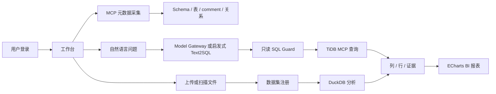

# 智能问数模块专项测试方案与执行报告

版本：v1.2

日期：2026-08-19

测试对象：Data AI Explorer / Aegis AI 智能问数模块

测试范围：数据源管理、TiDB/MySQL 直连、TiDB MCP 元数据采集、ChatBI、Text2SQL、只读 SQL 执行、ECharts 报表、认可报表大屏、CSV/Parquet 文件数据、受控本地目录、前后端联调

## 1. 测试结论

本次实现已完成“添加数据源 → ChatBI 提问 → Text2SQL → 数据库/文件执行 → ECharts → 用户认可 → 大屏复用”的可联调闭环。FastAPI 全量自动化 28/28 通过，前端构建、Python 编译、Compose 配置和浏览器主流程均通过。真实 TiDB 直连已读取 5 个对象及字段 Comment，区域 GMV 问题生成 JOIN SQL，返回 4 个区域结果并自动选择饼图；CSV/DuckDB 等原有链路保持通过。

当前结论为“开发验收通过，生产验收不通过”。真实 TiDB MCP 和模型网关、OIDC/RBAC、凭证库、数据源/报表持久化、Parquet 大文件、性能和容灾仍需在 Python 3.12 + Docker/Kubernetes 集成环境执行，不能用单一测试集群结果替代生产验收。

## 2. 测试目标与链路

1. 验证 MCP 能读取所有 Schema、表结构、字段类型、可空性和 comment，并转换为目录及关系数据。
2. 验证自然语言问题经过模型网关或启发式回退生成 SQL，SQL 只允许单条 SELECT/CTE，结果可追溯。
3. 验证 TiDB/MCP 或 DuckDB 结果能生成统一列、行和 ECharts option，前端展示 SQL、证据和图表。
4. 验证 CSV/Parquet 上传、受控目录扫描、数据集注册和按问题分析的完整流程。
5. 验证错误输入、危险意图、越权目录、非法文件、缺失资源和外部依赖故障均返回明确错误。

## 3. 测试环境

### 3.1 本次实际执行

| 项目 | 实际值 |
|---|---|
| 操作系统 | macOS ARM64 |
| Node.js | 23.x |
| Python | 系统 Python 3.9.6；临时环境补充 FastAPI/Pydantic/HTTPX/DuckDB/Pandas |
| 前端 | React + Vite + TypeScript + ECharts |
| 浏览器 | Codex in-app Browser，Chromium 内核 |
| API 联调 | FastAPI `18082`；Vite `5174` |
| 数据源 | Demo catalog、CSV、真实 TiDB 直连测试库 |
| MCP/模型 | Demo endpoint；未执行真实 MCP Server/模型网关 |

### 3.2 目标集成环境

Python 3.12+、`backend/requirements.txt` 全量依赖（含 MCP/PyArrow）、TiDB 7.x/8.x 企业 MCP Server、OpenAI-compatible 或自建模型网关、PostgreSQL/Redis/MinIO，以及正式认证、密钥和审计组件。

## 4. 测试数据

- Demo Schema：`sales`、`reporting`；表：`sales.orders`、`sales.customers`、`reporting.daily_sales`。
- 字段 comment：订单标识、客户标识、订单金额、下单时间、统计日期、GMV 等。
- 关系：订单客户外键、订单到日报表派生关系。
- [`backend/tests/fixtures/browser_sales.csv`](backend/tests/fixtures/browser_sales.csv)：2 行、3 列，包含日期、金额和区域。
- 安全样本：`DROP/UPDATE/DELETE`、多语句、危险自然语言、越权目录、TXT 文件、未知资源。

## 5. 功能测试矩阵

状态：`PASS` 已执行通过；`PARTIAL` 已有实现但仅 demo/局部验证；`TODO` 需集成环境或后续版本。

| ID | 场景 | 预期 | 状态 |
|---|---|---|---|
| MCP-001 | demo 采集 | 2 个 Schema、3 张表 | PASS |
| MCP-002 | 表结构解析 | 表名、字段、类型、nullable 正确 | PASS |
| MCP-003 | 字段 comment | comment 原样保留并展示 | PASS |
| MCP-004 | 关系展示 | foreign key 和 derived 关系可见 | PASS |
| MCP-005 | catalog 查询 | 返回最近一次采集结果 | PASS |
| MCP-006 | MCP 工具别名 | 支持 schema/table/column/query 别名 | PARTIAL |
| MCP-007 | token/header | 服务端携带认证，不进前端日志 | PARTIAL |
| MCP-008 | 工具缺失/超时 | 502、无堆栈和凭证泄露 | TODO |
| SQL-001 | 中文趋势问题 | SELECT、列行、line chart option | PASS |
| SQL-002 | 无模型配置 | catalog-aware 启发式只读回退 | PASS |
| SQL-003 | Model Gateway | 发送 schema 上下文、temperature=0 | PARTIAL |
| SQL-004 | DDL/DML SQL | `safe_select` 返回 400 | PASS |
| SQL-005 | 危险自然语言 | Text2SQL 前置拦截返回 400 | PASS |
| SQL-006 | MCP 查询工具 | 只读 SQL，最多 1000 行 | PARTIAL |
| SQL-007 | 页面结果 | SQL、证据和 ECharts 容器 | PASS |
| SQL-008 | 空/非数值结果 | table/empty 状态不破坏布局 | PARTIAL |
| FILE-001 | CSV 上传 | ID、行数、字段类型 | PASS |
| FILE-002 | Parquet 上传 | 与 CSV 具有相同契约 | TODO |
| FILE-003 | 非法扩展名 | 415 | PASS |
| FILE-004 | 受控目录扫描 | 仅扫描 CSV/Parquet，最多 100 文件 | PASS |
| FILE-005 | 根目录外扫描 | 403，不读取文件 | PASS |
| FILE-006 | CSV 按日聚合 | DuckDB SQL、结果、ECharts | PASS |
| FILE-007 | 页面目录到报表 | 扫描、选择、提问、生成报表 | PASS |
| FILE-008 | 大文件/恶意压缩 | 配额和超时限制 | TODO |
| UI-001 | 登录和工作台 | 进入工作台并自动采集 | PASS |
| UI-002 | API 不可用 | 页面可用并显示失败提示 | PASS |
| UI-003 | TiDB 结构页 | Schema、表、comment、关系可展开 | PASS |
| UI-004 | 智能问数页 | 问题、SQL、证据、图表完整 | PASS |
| UI-005 | 文件数据页 | 目录扫描后出现分析器 | PASS |
| UI-006 | 退出登录 | 返回登录页并清理页面状态 | PASS |
| UI-007 | 键盘/屏幕阅读器 | 焦点、label、状态文本完整 | TODO |

## 6. 接口与安全测试

已执行并通过：`/health`、TiDB demo introspect/catalog、query submit/status、事件和资产筛选/404、CSV upload、非法扩展名、目录 allowlist/deny、dataset analyze。正常问数返回 202、operation、SQL、行列、证据和 chart；未知资源返回 404。

已修复两项真实问题：

1. 原先 `drop table` 等危险自然语言会被启发式 SQL 改写；现在在 Text2SQL 前拒绝写入/管理意图。
2. DuckDB 不支持 `CREATE VIEW ... read_csv_auto(?)` 的参数化路径；现在对服务端生成路径做单引号转义，并关闭 CSV 行数统计文件句柄。

尚未通过生产安全验收：登录仍为前端演示；尚无 OIDC、RBAC/ABAC、租户隔离、字段脱敏、SQL AST 完整策略、审计持久化、模型出境策略和 Secret Vault。

## 7. 自动化测试与执行命令

测试文件：[`backend/tests/test_smart_query.py`](backend/tests/test_smart_query.py)、[`backend/tests/test_chatbi.py`](backend/tests/test_chatbi.py) 及其余后端回归测试。

后端命令：在 `backend` 目录执行 `python -m unittest discover -s tests -p 'test_*.py'`。本次结果：`Ran 28 tests`、`OK`。新增覆盖数据源、凭证脱敏、ChatBI、危险意图、大屏创建/查询/移除。

静态与部署命令：`npm run build --prefix apps/web`、`python3 -m compileall -q backend`、`docker compose config --quiet`、`git diff --check`。应用主包 gzip 约 86 KB，ECharts 运行时 gzip 约 188 KB 并按需加载；图表 chunk 仍超过默认 500 KB 原始体积告警，后续可继续按图表类型拆包。

## 8. 浏览器 E2E 冒烟

使用 FastAPI `18082` 和 Vite `5174` 完成：

1. 登录后自动采集并显示“已采集 2 个 Schema”。
2. TiDB 结构页显示 2 个 Schema、3 张表、2 条关系；展开 `sales.orders` 可见 `order_id` comment“订单唯一标识”。
3. 数据源页面显示真实 TiDB 与演示源；添加按钮打开 TiDB/MySQL 表单，密码不回显。
4. ChatBI 输入“各区域 GMV 占比”，右侧返回饼图、4 行数据、只读 SQL 和证据。
5. 点击“认可并加入大屏”后，大屏出现报表卡片，可再次分析或移除。
6. 390×844 视口 `scrollWidth=390`，控制台无 error。

## 9. 未执行的集成、性能和容灾测试

| 类别 | 后续方案 | 门槛 |
|---|---|---|
| 真实 MCP | token、分页、无权限、超时、Schema 变更 | 全部可恢复，无凭证泄露 |
| 真实模型 | NL2SQL 评测集、Prompt Injection、Provider 限流 | 业务准确率达标，危险/越权阻断 100% |
| Parquet | Python 3.12 + PyArrow 等价用例 | CSV/Parquet 结果一致 |
| 性能 | k6/Locust：100 并发、50 并发问数、1GB 文件 | API P95 <500ms，简单问数 P95 <15s |
| 稳定性 | 24 小时、TiDB 断连、模型限流、Redis 重启 | 无泄漏，任务可恢复 |
| Compose/K8s | 冷启动、重启、滚动升级、回滚、节点故障 | RPO ≤15 分钟，RTO ≤60 分钟 |
| 离线 | 无公网导入镜像、依赖和模型 | 核心问数和目录功能可用 |

当前机器没有可用 Docker Engine 响应，且 Python 3.9 不满足项目的 Python 3.12+ 运行约定；因此上述集成项没有被虚报为通过。

## 10. 生产阻断项与退出标准

阻断项：演示登录、数据源/凭证/报表仍为进程内存、真实 MCP/模型未集成验收、Parquet 未实测、正则 SQL Guard 尚未升级 AST、缺少权限/审计/脱敏、无大文件配额和性能基线。

## 11. v1.2 ChatBI 增量执行记录

| 用例 | 结果 | 实际证据 |
|---|---|---|
| 数据库源添加与测试 | PASS | API 返回 `ready`、5 个对象，响应无密码字段 |
| CSV 数据源 | PASS | 上传 2 行 CSV 后可在 ChatBI 选择并查询 |
| 自然语言转 SQL | PASS | “各区域 GMV 占比”生成订单与客户维表 JOIN 的只读 SQL |
| 真实 TiDB 执行 | PASS | 返回华南、西南、华北、华东 4 行聚合结果 |
| 图表类型推理 | PASS | 占比问题生成 `pie` ECharts Option；趋势问题生成 `line` |
| 报表认可和大屏 | PASS | 认可后大屏展示数据源、问题、图表和认可人，可再次分析/移除 |
| 桌面浏览器 | PASS | 双栏对话/报表布局正常，饼图和数据表可见，控制台 0 error |
| 移动端 390×844 | PASS | 单列卡片，`scrollWidth=390`，无横向溢出 |
| FastAPI 全量回归 | PASS | 28/28，新增 `backend/tests/test_chatbi.py` |
| 模型接入回归 | PASS | 32/32，覆盖 Provider、凭证脱敏、探测、默认模型和环境网关就绪状态 |
| React 生产构建 | PASS | TypeScript/Vite 通过；ECharts 运行时动态分包 |

真实联调仅一个节点暴露 TiDB SQL 端口，其余节点未误当作 SQL 入口。测试数据由 `scripts/tidb_chatbi_demo.sql` 在隔离库中幂等生成。仓库不记录测试服务器密码；生产必须使用只读账号、精确主机白名单和 Secret Manager。

生产候选版本必须满足：真实 MCP 和模型网关集成用例通过；CSV/Parquet/大文件通过；OIDC/RBAC/租户/审计/脱敏通过；PostgreSQL/MinIO 持久化和备份恢复通过；性能、稳定性、离线部署和 Playwright CI 门禁通过；P0/P1 安全缺陷为零。

建议顺序：真实 MCP/模型 → 权限和持久化 → Parquet/大文件 → 性能、容灾和离线部署。
