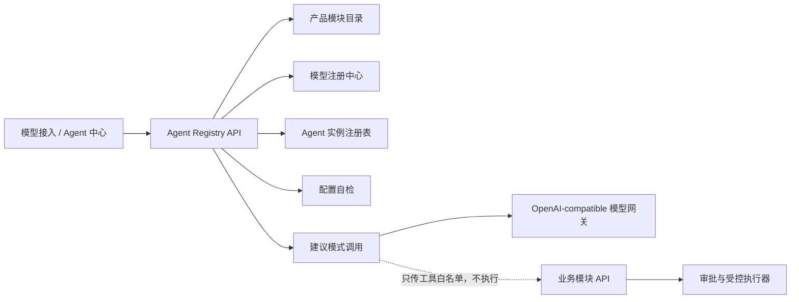

# 模块 Agent 功能开发说明

## 1. 产品目标

模型接入成功后，管理员不应再逐项填写 Prompt、工具和权限。系统以产品目录中的 8 个一级模块为模板，一键创建智能问数、企业知识库、数据资产与治理、AIOps、TiDB SQL 优化、场景指挥、任务审批、平台管理 Agent。

推荐点击路径：

`登录 → 模型接入 → 保存并测试 → 设为默认 → 一键创建模块 Agent → Agent 中心 → 自检 → 对话测试 → 进入对应模块`

“一键创建”只完成 Agent 控制面装配，不自动授予生产写权限，也不自动执行任何外部工具。

## 2. 用户能力

| 操作 | 用户结果 | 约束 |
|---|---|---|
| 一键创建全部 | 为尚未创建的模块生成 Agent | 幂等，不产生重复实例 |
| 单独创建 | 只创建选定模块 Agent | 必须存在已验证模型 |
| 启用/停用 | 控制 Agent 是否接收对话测试 | 停用后调用返回冲突 |
| 配置自检 | 检查模型、能力和策略 | 不消耗模型 Token |
| 对话测试 | 验证 Prompt 和模型响应 | 建议模式，不执行工具 |
| 进入模块 | 跳转到 Agent 对应业务页 | 沿用当前用户权限 |
| 删除 | 删除实例，可从模板重建 | 不删除模型或业务数据 |

## 3. 模板生成

模板的唯一来源为 `backend/app/product_catalog.py`。模块名称、负责人、非规划状态功能和 API 引用分别生成 Agent 的名称、责任边界、能力清单和工具白名单。场景中心等跨功能模块额外登记已有场景运行 API，不允许用任意 URL 或任意 Shell 作为工具。

每个 Agent 固定保存：

- 模板与模块 ID；
- 创建时绑定的已验证模型连接引用；
- 模块能力与允许工具；
- `read_only` 或 `human_approval` 策略；
- 系统 Prompt、启停状态、自检和最近调用时间。

API Key 仍由模型注册中心单独管理，不复制到 Agent 记录或响应。

## 4. 运行架构

当前 FastAPI MVP 使用进程内注册表。生产实现需要迁移到 PostgreSQL，至少包含 `agent_template`、`agent_instance`、`agent_tool_binding`、`agent_run` 和 `agent_audit_event`，并用 `tenant_id + workspace_id` 做隔离和唯一约束。

## 5. 接口契约

| 方法 | 路径 | 用途 |
|---|---|---|
| GET | `/api/v1/agents/templates` | 读取 8 个模块模板 |
| POST | `/api/v1/agents/provision` | 批量幂等创建 |
| GET/POST | `/api/v1/agents` | 查询或单独创建 |
| PUT | `/api/v1/agents/{id}/enabled` | 启停 |
| POST | `/api/v1/agents/{id}/test` | 配置自检 |
| POST | `/api/v1/agents/{id}/invoke` | 建议模式对话测试 |
| DELETE | `/api/v1/agents/{id}` | 删除实例 |

批量创建响应区分 `created` 与 `existing`，方便页面明确告诉用户本次创建数量。模型未验证或未激活时返回 HTTP 409；模型删除后，所有绑定该连接的 Agent 标记为 `error`。

## 6. 安全与落地边界

- 模型仅看到模块范围和允许工具，不接收模型 API Key。
- 对话测试只请求模型，不从模型输出自动触发 API。
- 协同模块以及包含审批、回滚、人工确认的模块使用 `human_approval`。
- 生产工具调用必须引入结构化 Tool Schema、RBAC/ABAC、参数校验、幂等键、审批票据、超时、熔断、回滚和不可变审计。
- 模型变更不隐式重绑已有 Agent；管理员应显式迁移并重新自检，避免无审计的行为漂移。
- 本地版可使用进程内状态验证流程，生产版必须持久化并支持多实例并发控制。

## 7. 验收标准

1. 模板数量与产品一级模块数量一致，当前均为 8。
2. 未接入已验证默认模型时不能创建 Agent。
3. 连续两次一键创建后实例总数仍为 8。
4. 每个 Agent 至少具备一项能力和一个允许工具。
5. 停用 Agent 后不能进行对话调用，重新启用并自检可恢复。
6. 删除模型连接后，绑定 Agent 立即显示不可用。
7. 对话测试响应明确为建议模式，高风险 Agent 返回需审批标记。
8. API 响应、日志和页面均不出现模型密钥。
